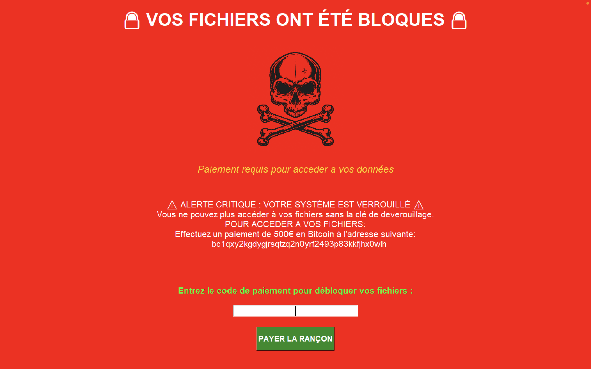

<<<<<<< HEAD
# EduLocker
=======
# EduLocker - Ransomware Éducatif



## ⚠️ AVERTISSEMENT ⚠️

**CE LOGICIEL EST STRICTEMENT ÉDUCATIF**

Ce projet est un POC (Proof of Concept) développé dans le cadre d'un cours de sécurité informatique pour démontrer le fonctionnement d'un ransomware. Il est conçu uniquement à des fins pédagogiques et de sensibilisation.

**NE PAS UTILISER À DES FINS MALVEILLANTES**

## Description

EduLocker est un projet éducatif à double fonction :

1. **Simulation de ransomware** : Verrouille temporairement l'interface utilisateur du système pour démontrer le fonctionnement d'un ransomware. Contrairement à un vrai ransomware, il ne chiffre aucun fichier et n'endommage pas le système.

2. **Outil anti-malware** : Détecte et supprime le ransomware EduLocker, illustrant comment les logiciels de sécurité identifient et neutralisent les menaces.

## Explication du Code

### 1. Composants Principaux

#### 1.1 Module Malware (Ransomware)

- **core/locker.py** : Composant principal du ransomware qui gère le verrouillage de l'écran. Il crée une interface graphique plein écran qui simule un écran de rançon, avec des messages menaçants et une demande de paiement. Fonctionnalités clés :

  - Création d'une interface de verrouillage en plein écran
  - Mode agressif optionnel (désactivation du gestionnaire de tâches, masquage de la barre des tâches)
  - Système de déverrouillage avec code secret
  - Auto-déverrouillage après un délai configurable

- **core/persistence.py** : Gère la persistance du malware sur le système, permettant son exécution automatique après un redémarrage. Implémente deux méthodes principales :

  - Ajout d'une clé dans le registre Windows (HKCU\Software\Microsoft\Windows\CurrentVersion\Run)
  - Création d'une tâche planifiée Windows

- **utils/system_info.py** : Collecte des informations sur le système cible, comme :
  - Système d'exploitation et version
  - Nom d'hôte et adresse IP
  - Informations sur l'utilisateur
  - Détection d'environnement virtuel

#### 1.2 Module Anti-Malware

- **core/anti_malware.py** : Implémente un outil de détection et de suppression du ransomware EduLocker. Composé de trois classes principales :
  - `EduLockerDetector` : Analyse le système pour détecter les traces du ransomware
  - `EduLockerRemover` : Supprime les instances détectées du ransomware
  - `AntiMalwareGUI` : Interface graphique pour l'outil anti-malware

### 2. Configuration et Messages

- **config/settings.py** : Fichier de configuration central qui contrôle le comportement du programme. Contient des paramètres pour :

  - Mode agressif (désactivation du gestionnaire de tâches, etc.)
  - Configuration de l'interface utilisateur
  - Méthodes de persistance
  - Codes de déverrouillage et d'urgence
  - Délai d'auto-déverrouillage

- **config/messages.py** : Contient les messages affichés par le ransomware en français et en anglais, incluant :
  - Titre et sous-titre de l'écran de verrouillage
  - Message principal de demande de rançon
  - Instructions de déverrouillage
  - Messages d'erreur et de confirmation

### 3. Point d'Entrée

- **main.py** : Point d'entrée principal du programme qui gère les différents modes d'exécution :
  - Mode normal : Affiche des avertissements, demande confirmation et exécute le verrouillage
  - Mode nettoyage (--cleanup) : Supprime toutes les méthodes de persistance
  - Mode anti-malware (--antimalware) : Lance l'interface graphique anti-malware
  - Mode scan (--scan) : Effectue une analyse anti-malware en ligne de commande

### 4. Fonctionnement Technique

#### Processus de Verrouillage

1. L'utilisateur lance le programme (après avertissements)
2. Le système collecte des informations sur l'environnement
3. Des méthodes de persistance sont installées (si configurées)
4. L'interface de verrouillage s'affiche en plein écran
5. En mode agressif, des actions supplémentaires sont effectuées (désactivation du gestionnaire de tâches, etc.)
6. Un minuteur est lancé pour l'auto-déverrouillage

#### Processus Anti-Malware

1. L'outil analyse le système à la recherche de traces d'EduLocker :
   - Processus en cours d'exécution
   - Entrées de registre
   - Tâches planifiées
   - Fichiers suspects
2. Les résultats sont affichés à l'utilisateur
3. Si des menaces sont détectées, l'utilisateur peut lancer le nettoyage
4. Le nettoyage supprime toutes les traces du ransomware

### 5. Mesures de Sécurité

Le projet intègre plusieurs mesures de sécurité pour éviter tout dommage réel :

- Aucun chiffrement de fichiers n'est effectué
- Auto-déverrouillage après un délai configurable
- Code d'urgence pour déverrouillage immédiat
- Nettoyage automatique en cas d'erreur
- Avertissements et confirmations multiples avant exécution

## Objectifs pédagogiques

### Côté Malware

- Comprendre les mécanismes d'attaque des ransomwares
- Étudier les techniques de verrouillage d'interface utilisateur
- Explorer les méthodes de persistance sur un système

### Côté Anti-Malware

- Apprendre les techniques de détection des logiciels malveillants
- Comprendre les méthodes de suppression et de nettoyage
- Étudier la restauration des systèmes compromis

### Général

- Sensibiliser aux bonnes pratiques de sécurité
- Développer une compréhension complète du cycle attaque/défense

## Prérequis

- Python 3.6 ou supérieur
- Environnement virtuel (VM) isolé pour les tests
- Privilèges administrateur pour certaines fonctionnalités

## Installation

```bash
# Cloner le dépôt
git clone https://github.com/votre-username/edulocker.git
cd edulocker

# Installer les dépendances
pip install -r requirements.txt
```

## Utilisation

**IMPORTANT**: Exécutez ce logiciel UNIQUEMENT dans un environnement virtuel isolé.

### Mode Ransomware (éducatif)

```bash
python main.py
```

### Mode Anti-Malware

Le projet inclut également un outil anti-malware pour détecter et supprimer EduLocker:

```bash
# Interface graphique anti-malware
python main.py --antimalware

# Analyse en ligne de commande
python main.py --scan
```

### Codes de déverrouillage

- Code standard: `UNLOCK2024`
- Code d'urgence: `EMERGENCY_EXIT_123`

## Configuration

Le comportement d'EduLocker peut être personnalisé en modifiant le fichier `config/settings.py`.

### Mode agressif

Le mode agressif active des fonctionnalités plus intrusives comme:

- Désactivation du gestionnaire de tâches
- Masquage de la barre des tâches
- Terminaison du processus explorer.exe

**ATTENTION**: Ces fonctionnalités peuvent rendre votre système temporairement inutilisable. Utilisez-les uniquement dans un environnement virtuel.

## Sécurité et précautions

- Créez toujours un snapshot de votre VM avant d'exécuter ce logiciel
- N'exécutez jamais ce code sur un système de production
- Le programme s'auto-déverrouille après 10 minutes par défaut
- Utilisez Ctrl+C pendant le compte à rebours initial pour annuler l'exécution

## Structure du projet

```
edulocker/
├── config/           # Fichiers de configuration
├── core/             # Fonctionnalités principales
├── gui/              # Interface graphique
├── utils/            # Utilitaires
├── tests/            # Tests unitaires
├── main.py           # Point d'entrée
└── README.md         # Documentation
```

## Désinstallation

Pour nettoyer complètement votre système après utilisation:

```bash
python main.py --cleanup
```

## Conclusion

EduLocker est un outil pédagogique qui illustre à la fois les mécanismes d'attaque des ransomwares et les techniques de défense anti-malware. Sa conception en deux parties (malware et anti-malware) permet de comprendre le cycle complet d'une attaque et de sa neutralisation, tout en garantissant qu'aucun dommage réel n'est causé aux systèmes.

Le code est abondamment commenté et structuré de manière modulaire pour faciliter la compréhension des différents aspects de la sécurité informatique liés aux ransomwares.

## Licence

Ce projet est distribué sous licence MIT. Voir le fichier LICENSE pour plus de détails.

## Avertissement légal

L'utilisation de ce logiciel pour des activités illégales est strictement interdite. Les auteurs déclinent toute responsabilité en cas d'utilisation abusive.

## Auteur

IGBYA - Cours de Sécurité Informatique
>>>>>>> master
